# VOIDR（ゲーム公式サイト兼オンラインストア）

## プロジェクト概要

VOIDRは近未来を舞台とした戦術FPSゲーム「VOIDR」の公式Webサイト兼オンラインストアです。  
このアプリケーションはSpring Boot 3とMyBatisを用いて構築され、  
ゲーム紹介ページ・ショップ機能・ユーザー管理機能などを提供します。

## 機能一覧

- **ホーム／情報ページ**  
  ゲーム紹介、ストーリー、マップ、武器、キャラクター、最新ニュースページを閲覧できます。
    

- **ECトップ画面**  
  商品一覧、検索バー、ログイン、お問い合わせ、新着ニュース
  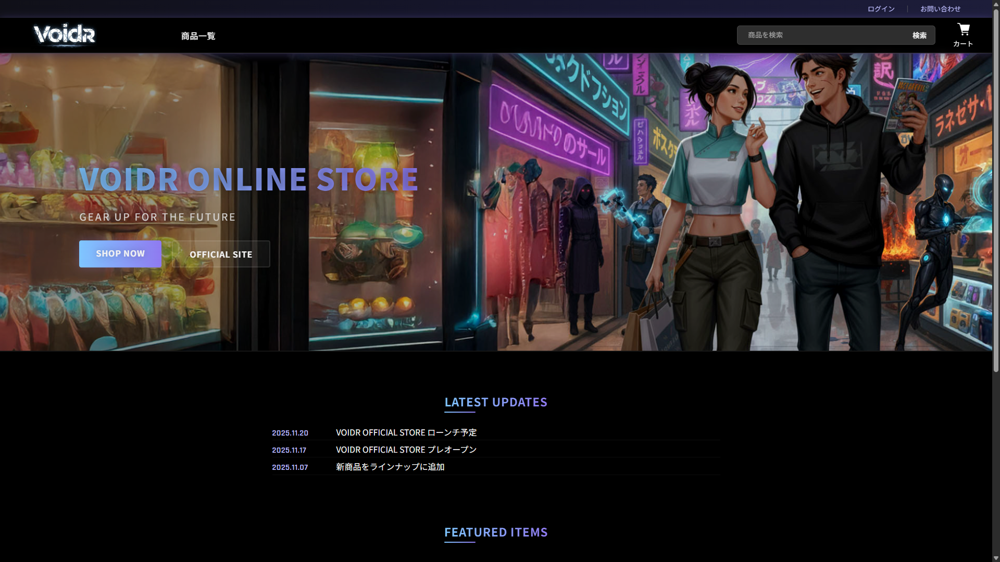  

- **お問い合わせ**  
  ログインしていなくても、名前・メール・件名・本文を入力して連絡フォームからお問い合わせを送信できます。
  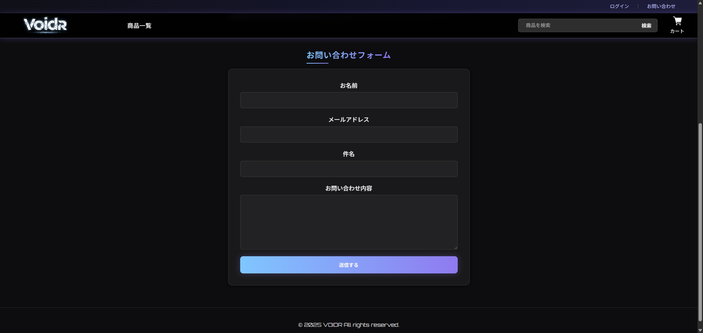

- **ユーザー認証**  
  ユーザー名・表示名・メール・パスワード・住所・電話番号を入力して新規登録、ログイン、ログアウトが可能です。
  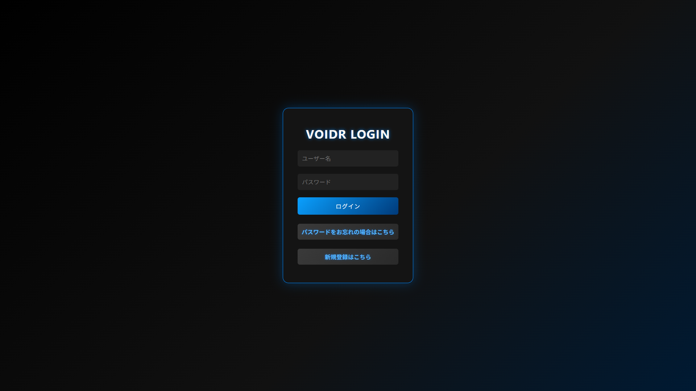

- **パスワード再設定**  
  登録されたメールアドレスに6桁のPINコードを送信し、そのPINと新しいパスワードを入力することで再設定できます。
  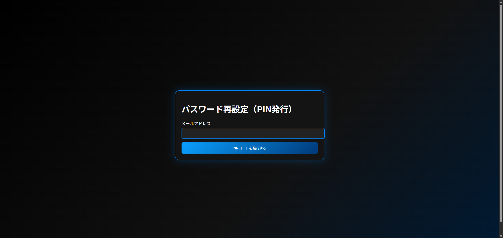

- **ショップ機能**
  - **商品一覧**  
    商品名・価格・概要・サムネイル画像を表示し、検索やカテゴリーで絞り込みができます。
    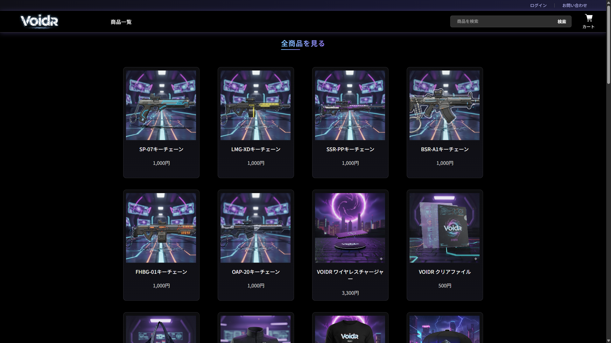
    
  - **商品詳細**  
    各商品ごとに詳細情報、画像リストを確認できます。
    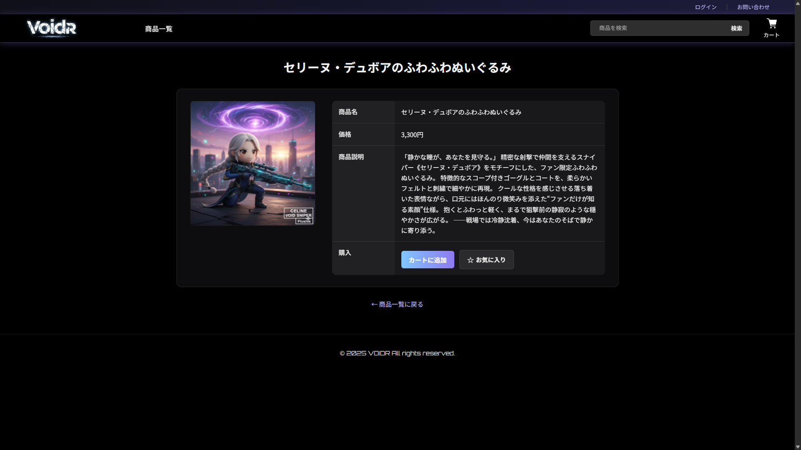
    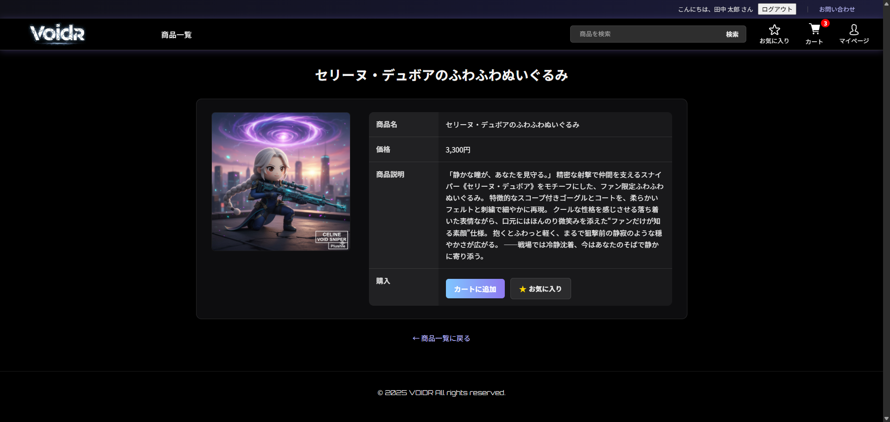

  - **お気に入り登録**  
    商品をお気に入りに追加・削除でき、ユーザー別のお気に入り一覧を表示します。
    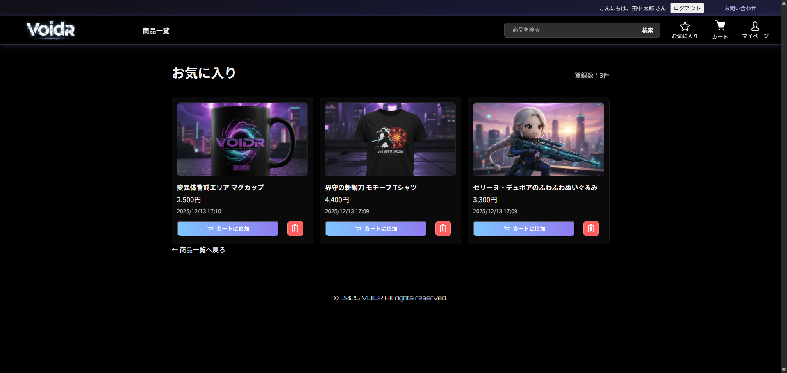

  - **カート**  
    ログインユーザーが商品をカートに追加し、数量の変更や削除、合計金額の計算、バッジ表示などが行えます。
    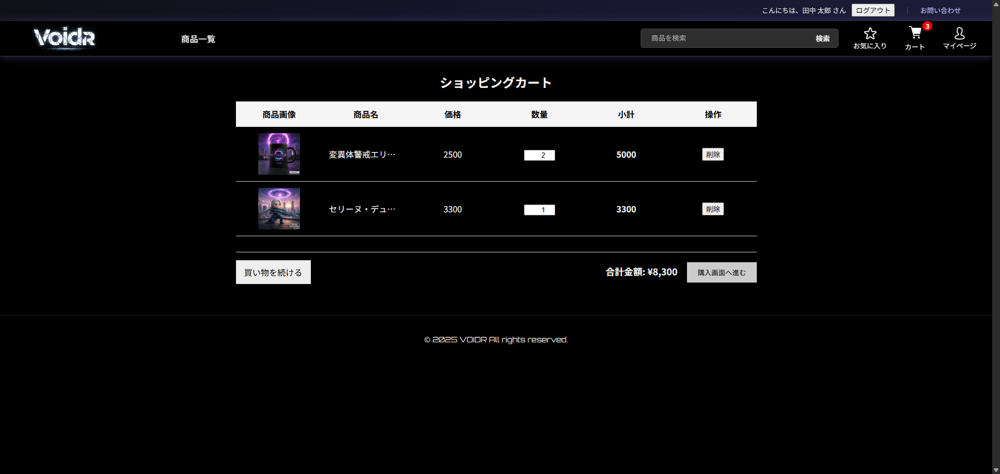

    - **購入の流れ**
      注文時に支払い方法・配送先・希望日時を入力して注文を作成  
      購入内容の確認 → 確定 → 購入確定メール自動送信 → 購入確定画面
    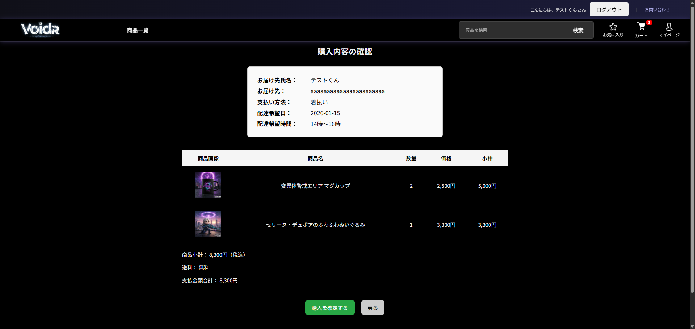
    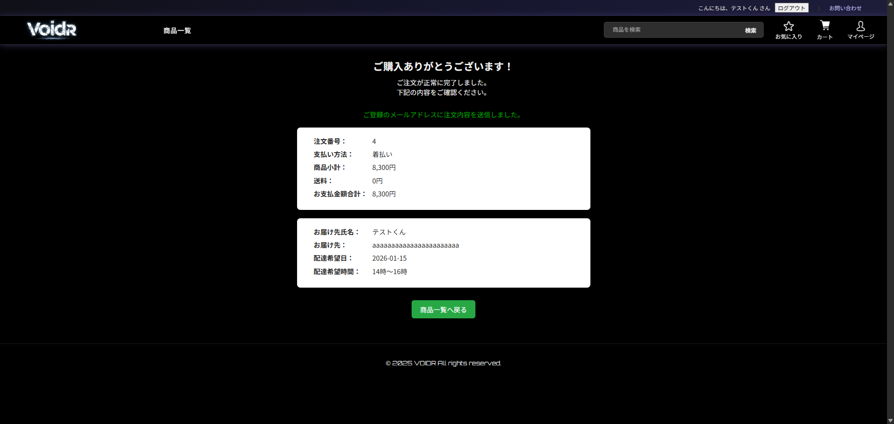

  - **購入履歴**  
    注文詳細や配送ステータスを確認できる
    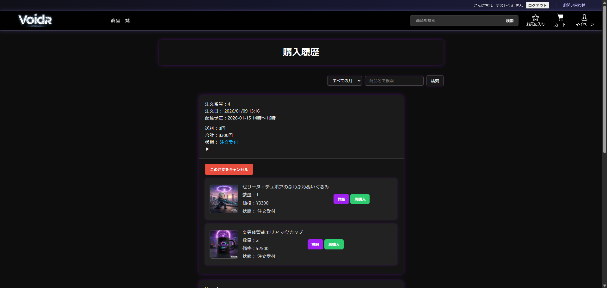
    
- **管理機能**
  - **商品管理**  
    商品の登録・編集・ソフト削除/復活に対応し、XMLとデータベースの同期が可能です。
    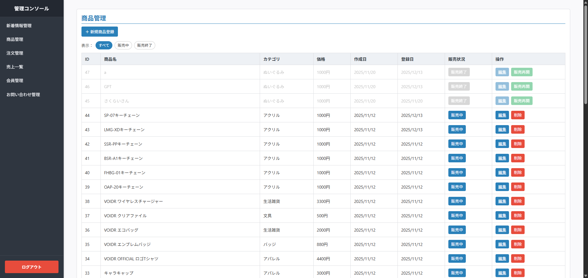
    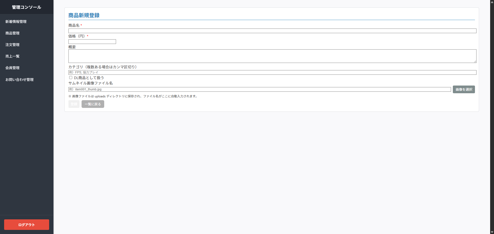  
    
  - **会員管理**  
    会員一覧の表示・検索、ユーザー情報の更新、権限の変更、退会（論理削除）が行えます。
    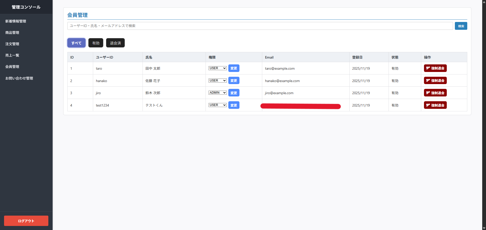  
    
  - **新着情報管理**  
    ニュースの追加・編集・削除機能を持ち、トップページには最新3件のニュースが表示されます。
    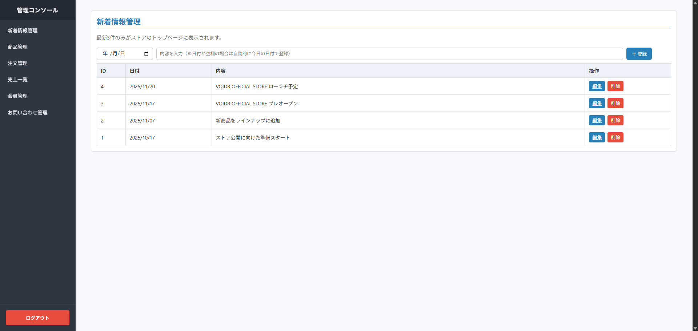

- **メール通知**  
  GmailのSMTPを使用し、環境変数で設定したパスワードを用いてメール送信を行います（`spring-boot-starter-mail`利用）。

- **パスワードポリシー／バリデーション**  
  ユーザー登録やパスワード再設定時に英数字8〜20文字などの制約を適用しています。

- **ソフトデリート**  
  商品やユーザーは `is_deleted` または `enabled` フラグにより論理削除され、管理画面から復元可能です。

- **その他**  
  ニュース管理・配送先管理などの追加機能、およびデータベース初期化用 `schema.sql` を備えています。

## 技術スタック

| 区分 | 使用技術 |
|------|----------|
| **バックエンド** | Java 21 / Spring Boot 3.5.x / Spring Security / MyBatis（Mapper XML）/ Jakarta Validation / Lombok |
| **テンプレートエンジン** | Thymeleaf / Thymeleaf Layout Dialect |
| **データベース** | PostgreSQL |
| **メール送信** | Spring Boot Starter Mail（Gmail SMTP） |
| **ビルドツール** | Gradle（Java 21 toolchain） |
| **フロントエンド** | HTML / CSS / JavaScript（Canvasアニメーション等） |
| **テスト** | Spring Boot Test / MyBatis Test |
| **運用・環境構築** | Dockerfile / Spring Bootによるアプリケーションのコンテナ化 |
| **その他ライブラリ** | MyBatis Spring Boot Starter / Thymeleaf Extras Spring Security |
